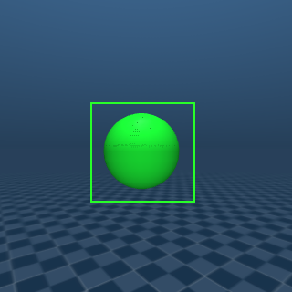
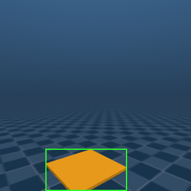
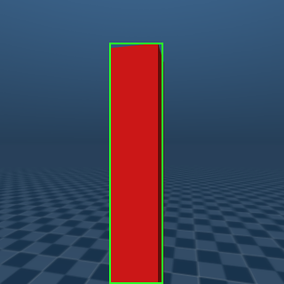
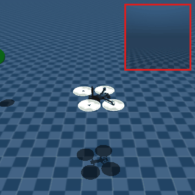
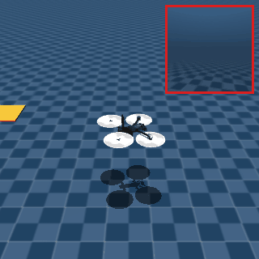
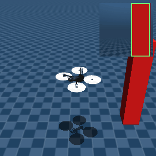

# StreamPilot

Gymnasium environments for a Skydio X2 drone in MuJoCo, built to transfer to a real drone that
flies by onboard vision.

- **Drone:** gravity-compensated body with world-aligned slide joints and a yaw hinge. Velocity
  actuators stand in for the flight controller (~0.2 s response), so there are no attitude dynamics.
  It flies at a fixed altitude (`flight_altitude`) and cannot climb or descend.
- **Action:** `[vx, vy, yaw_rate]` in `[-1, 1]`, body frame (x = nose), scaled to 2 m/s and
  90 deg/s. This matches offboard velocity APIs such as MAVSDK's `VelocityBodyYawspeed` with
  `down = 0` (altitude hold). Control runs at 20 Hz.
- **Camera:** one onboard camera fixed at the nose, looking straight ahead (level), 70° FOV.
- **Observation** (`obs_mode`):
  - `"detection"` (default): `[visible, cx, cy, w, h]`, the task target's bounding box in YOLO's
    normalized `xywhn` format (zeros when not detected). In sim it comes from projecting the target
    into the camera; `detection_noise` and `detection_dropout` imitate a real detector. On the real
    drone, feed it your detector's output.
  - `"pixels"`: the camera image, `uint8 (84, 84, 3)` (`image_size`).
  - `"state"`: privileged state, for debugging, scripted controllers and asymmetric critics.

  One observation has no motion information, so stack frames (e.g. `gymnasium.wrappers.FrameStackObservation`).

  This is the onboard camera itself, with the `"detection"` box drawn in green:

  <table>
  <tr>
  <td align="center"><br>waypoint</td>
  <td align="center"><br>landing</td>
  <td align="center"><br>tracking</td>
  </tr>
  </table>

| ID                 | Task | Detector target |
| ------------------ | ---- | --------------- |
| `DroneWaypoint-v0` | Reach a sequence of waypoints at flight altitude; only the current one is shown | green ball |
| `DroneLanding-v0`  | Landing approach at 0.6 m: hover 1.2 m from the pad, facing it with the pad in view, then hand off (`info["handoff_offset"]`) to the flight controller's own landing | orange pad |
| `DroneTracking-v0` | Stay 1.5 m (horizontally) from a wandering person-sized pillar, facing it | red pillar |

<table>
<tr>
<td align="center"><br><code>DroneWaypoint-v0</code></td>
<td align="center"><br><code>DroneLanding-v0</code></td>
<td align="center"><br><code>DroneTracking-v0</code></td>
</tr>
</table>

Scripted controllers (chase camera, onboard detection inset — red frame means no detection).
Regenerate with `uv run python docs/media/make_gifs.py`.

The drone starts facing a random direction in waypoint and landing, so it has to search first.
`info` includes `target_in_view`, and `is_success` for waypoint and landing. With a level camera
the pad leaves the view once the drone is within ~1.4x its height of it, which is why landing
ends in a hand-off from a distance instead of a touchdown.

```python
import gymnasium as gym
import streampilot.env  # registers the environments

env = gym.make("DroneLanding-v0", detection_noise=0.01, detection_dropout=0.05)
obs, info = env.reset(seed=0)  # obs = [visible, cx, cy, w, h]
```

## Formation tasks (multiple drones)

Teams of 2 or 3 drones (`num_drones`, default 3) do the same three tasks together, in a formation:
a column (one drone in front of the other) for two drones, an equilateral triangle with the leader
(drone 0) at the apex for three. Slots are `formation_spacing` (1 m) apart.

| ID                          | Task |
| --------------------------- | ---- |
| `DroneFormationWaypoint-v0` | Each stage shows one ball per drone (in the drone's colour, its detector target), laid out in the formation shape at a random position and rotation. The stage is complete when every drone is on its ball at the same time |
| `DroneFormationLanding-v0`  | One pad. The drones land in the formation shape: the leader on the pad, the others on spots behind it. They hand off together, each 1.2 m in front of its landing spot, facing the pad with it in view (`info["handoff_offset"]`, one row per drone) |
| `DroneFormationTracking-v0` | The leader follows the pillar at 1.5 m, the others hold their slots behind it, and all of them face the target |

The formation frame points from the leader to the target, so the team can approach from any side.

- **Action:** `(num_drones, 3)`, one body-frame `[vx, vy, yaw_rate]` row per drone.
- **Observation:** one row per drone. In `"detection"` mode a row has the drone's own detection
  `[visible, cx, cy, w, h]`, a one-hot of its slot, and its teammates' horizontal positions in its
  body frame. A real team would share those positions over the radio. So one shared policy can
  run on each row (decentralised), or one policy on all rows (centralised). `"pixels"` stacks the
  onboard images; `"state"` stacks privileged state.
- **Reward:** one team reward, the per-drone terms averaged. The episode ends, with a penalty,
  when a drone leaves the arena or two drones come within `min_separation` (0.6 m).

```python
env = gym.make("DroneFormationLanding-v0", num_drones=2)
obs, info = env.reset(seed=0)  # obs.shape == (2, 9)
obs, reward, terminated, truncated, info = env.step(env.action_space.sample())
```

```sh
uv run streampilot formation-waypoint                   # 3 drones, scripted controller, overview camera
uv run streampilot formation-landing --drones 2
```

`streampilot-train` does not support the formation tasks yet.

## Watching the tasks

```sh
uv run streampilot landing                        # scripted controller in the viewer
uv run streampilot tracking --policy random --camera overview
# --policy scripted|random|zero  --camera chase|overview|onboard|free
# --detection-noise F  --detection-dropout P  --episodes N  --seed S
```

The inset in the top right shows the onboard camera, with the observed detection box in green
(a red frame means no detection). The scripted controllers read privileged state, so they show
what good behaviour looks like; they are not vision policies.

## Training with Stream AC(λ)

`streampilot.stream_x` implements Stream AC(λ) from [Elsayed, Vasan & Mahmood (2024),
*Streaming Deep Reinforcement Learning Finally Works*](https://arxiv.org/abs/2410.14606). It learns from
each transition once, as it arrives, with no replay buffer or batches, so the same loop can keep
learning on the drone itself. Stability comes from the ObGD optimizer (eligibility traces with an
overshooting-bounded step size), sparse initialization, LayerNorm, and online observation and
reward normalization. Stream AC is the continuous-action member of the Stream-X family (Stream
Q(λ) and SARSA(λ) need discrete actions).

```sh
uv run streampilot-train waypoint                     # detection obs, 2M steps, ~1 h on one core
uv run streampilot-train landing --detection-noise 0.01 --detection-dropout 0.05
uv run streampilot-train tracking --obs-mode state --frames 1  # privileged state, for debugging
uv run streampilot waypoint --policy runs/waypoint_seed0/final.pt   # watch the result
```

The agent's input is the last `--frames` (default 4) observations plus the previous action.
Episodes (return, length, success, out-of-bounds rate, final distance/heading error, TD error) and a deterministic
evaluation every 100k steps are logged to [Trackio](https://github.com/gradio-app/trackio), project
`streampilot` with one group per task; `uv run trackio show` opens the dashboard. Training
sets `HF_HUB_OFFLINE=1` (logs stay local), since Trackio otherwise blocks on Hub network calls. Checkpoints
(`latest.pt` at each evaluation, `final.pt`) go to `runs/TASK_seedSEED/`. On the real drone, `Policy` takes raw detector output and applies
the same history and the normalization frozen at the end of training:

```python
from streampilot.policy import Policy

policy = Policy.load("runs/waypoint_seed0/final.pt")
policy.reset()
action = policy(detection)  # [visible, cx, cy, w, h] -> [vx, vy, yaw_rate] in [-1, 1]
```

## Non-streaming baselines

`streampilot.baselines` has PPO and SAC, the batch counterparts Stream AC is compared against in
the paper. They follow CleanRL's `ppo_continuous_action` and `sac_continuous_action` and their
default hyperparameters. The only change is that PPO bootstraps through time-limit truncation.
They run in the same training loop as Stream AC: one environment, the same input features, the same
logging and evaluation, and the same checkpoint format. So `--policy`, `Policy` and the Trackio
dashboard work for all three.

```sh
uv run streampilot-train waypoint --algo ppo          # 2048-step rollouts, 10 epochs of minibatches
uv run streampilot-train waypoint --algo sac          # 1M replay buffer, one update per step
uv run streampilot-train waypoint --algo sac --help   # the algorithm's hyperparameters
```

Runs go to `runs/ALGO_TASK_seedSEED/` and share the task's Trackio group with the Stream AC runs.
PPO uses the same online observation normalization and reward scaling as Stream AC. SAC uses raw
features and rewards, since running statistics would drift away from the transitions already in its
replay buffer. On one core, PPO runs about 1600 steps/s, Stream AC about 700 and SAC about 150,
so 2M steps of SAC take roughly 4 h.

## Layout

- `src/streampilot/env/base.py`: `DroneBaseEnv` (scene, actions, camera, detection,
  rendering). Tasks override `_build_scene` (add bodies through `mujoco.MjSpec`),
  `_task_reset`, `_task_before_step`, `_task_target_geom`, `_task_obs`, `_task_step` and `_task_info`.
- `src/streampilot/env/{waypoint,landing,tracking}.py`: the three tasks.
- `src/streampilot/env/formation/`: the multi-drone versions. `FormationBaseEnv` puts N copies of
  the drone into one scene; `formation_offsets` defines the shapes.
- `src/streampilot/visualize.py`: viewer script and scripted controllers.
- `src/streampilot/stream_x/`: Stream AC(λ) (`agents.py`, `optim.py`), observation history and
  normalization (`wrappers.py`).
- `src/streampilot/baselines/`: PPO (`ppo.py`) and SAC (`sac.py`).
- `src/streampilot/train.py`: training script for all algorithms (`--algo`);
  `src/streampilot/policy.py`: deployable policy loaded from any checkpoint.
- `src/streampilot/assets/skydio_x2/`: drone scene and mesh (Apache-2.0, see `LICENSE`).
- `external/mujoco_drone_env`: the original prototype, kept for reference.

## Tests

```sh
uv run pytest   # renders offscreen with MUJOCO_GL=egl (set in tests/conftest.py)
```

On the GPU this was developed on, rendering the same state can differ by a few intensity levels
depending on what was drawn before. The pixel tests allow for that; detection and state
observations are exactly reproducible.
