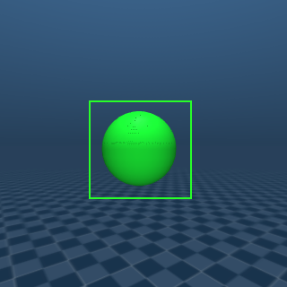
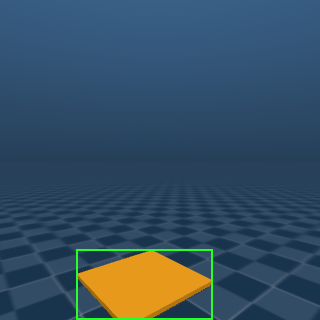
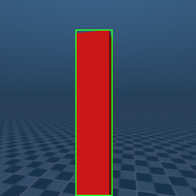
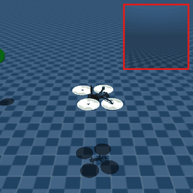
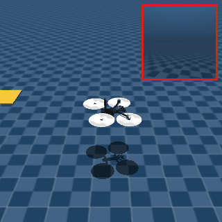
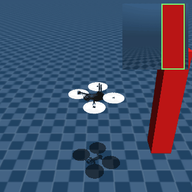
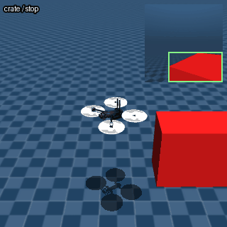
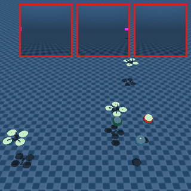
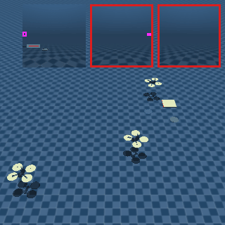
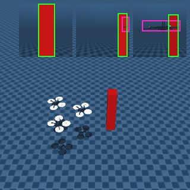

# StreamPilot

Gymnasium environments for a Skydio X2 drone in MuJoCo, built to transfer to a real drone that
flies by onboard vision.

- **Drone:** gravity-compensated body with world-aligned slide joints and a yaw hinge. Velocity
  actuators stand in for the flight controller (~0.2 s response), so there are no attitude dynamics.
  It flies at a fixed altitude (`flight_altitude`) and cannot climb or descend.
- **Action:** `[vx, vy, yaw_rate]` in `[-1, 1]`, body frame (x = nose), scaled to 2 m/s and
  90 deg/s. This matches offboard velocity APIs such as MAVSDK's `VelocityBodyYawspeed` with
  `down = 0` (altitude hold). Control runs at 20 Hz.
- **Camera:** one onboard camera fixed at the nose, looking straight ahead (level), 70° FOV.
- **Observation** (`obs_mode`):
  - `"detection"` (default): `[visible, cx, cy, w, h]`, the task target's bounding box in YOLO's
    normalized `xywhn` format (zeros when not detected). In sim it comes from projecting the target
    into the camera; `detection_noise` and `detection_dropout` imitate a real detector. On the real
    drone, feed it your detector's output.
  - `"pixels"`: the camera image, `uint8 (84, 84, 3)` (`image_size`).
  - `"state"`: privileged state, for debugging, scripted controllers and asymmetric critics.

  One observation has no motion information, so stack frames (e.g. `gymnasium.wrappers.FrameStackObservation`).

  This is the onboard camera itself, with the `"detection"` box drawn in green:

  <table>
  <tr>
  <td align="center"><br>waypoint</td>
  <td align="center"><br>landing</td>
  <td align="center"><br>tracking</td>
  </tr>
  </table>

| ID                 | Task | Detector target |
| ------------------ | ---- | --------------- |
| `DroneWaypoint-v0` | Reach a sequence of waypoints at flight altitude; only the current one is shown | green ball |
| `DroneLanding-v0`  | Landing approach at 0.6 m: hover 1.2 m from the pad, facing it with the pad in view, then hand off (`info["handoff_offset"]`) to the flight controller's own landing | orange pad |
| `DroneTracking-v0` | Stay 1.5 m (horizontally) from a wandering person-sized pillar, facing it | red pillar |
| `DroneMorphingTracking-v0` | Tracking, but every 4-8 s the target switches shape (pillar, cylinder, crate, floating ball) and motion (wander, circle, straight line, stop); `info` has `shape`, `motion`, `switched` | red shape |

<table>
<tr>
<td align="center"><br><code>DroneWaypoint-v0</code></td>
<td align="center"><br><code>DroneLanding-v0</code></td>
<td align="center"><br><code>DroneTracking-v0</code></td>
</tr>
<tr>
<td align="center"><br><code>DroneMorphingTracking-v0</code><br>(switching every ~3 s here)</td>
</tr>
</table>

Scripted controllers (chase camera, onboard detection inset — red frame means no detection).
Regenerate with `uv run python docs/media/make_gifs.py`.

The drone starts facing a random direction in waypoint and landing, so it has to search first.
`info` includes `target_in_view`, and `is_success` for waypoint and landing. With a level camera
the pad leaves the view once the drone is within ~1.4x its height of it, which is why landing
ends in a hand-off from a distance instead of a touchdown.

```python
import gymnasium as gym
import streampilot.env  # registers the environments

env = gym.make("DroneLanding-v0", detection_noise=0.01, detection_dropout=0.05)
obs, info = env.reset(seed=0)  # obs = [visible, cx, cy, w, h]
```

## Formation tasks (multiple drones)

Teams of 2 to 5 drones (`num_drones`, default 3) do the same three tasks together, in a formation:
a column (one drone in front of the other) for two drones, an equilateral triangle with the leader
(drone 0) at the apex for three, a diamond for four and a wedge for five. Slots are `formation_spacing` (1 m) apart.

| ID                          | Task |
| --------------------------- | ---- |
| `DroneFormationWaypoint-v0` | Each stage shows one ball per drone (in the drone's colour, its detector target), laid out in the formation shape at a random position and rotation. The stage is complete when every drone is on its ball at the same time |
| `DroneFormationLanding-v0`  | One pad. The drones land in the formation shape: the leader on the pad, the others on spots behind it. They hand off together, each 1.2 m in front of its landing spot, facing the pad with it in view (`info["handoff_offset"]`, one row per drone) |
| `DroneFormationTracking-v0` | The leader follows the pillar at 1.5 m, the others hold their slots behind it, and all of them face the target |

<table>
<tr>
<td align="center"><br><code>DroneFormationWaypoint-v0</code></td>
<td align="center"><br><code>DroneFormationLanding-v0</code></td>
<td align="center"><br><code>DroneFormationTracking-v0</code></td>
</tr>
</table>

Scripted controllers, overview camera, three drones. The insets are each drone's onboard view
(leader on the left), with teammates it can see boxed in magenta.

The formation frame points from the leader to the target, so the team can approach from any side.

- **Action:** `(num_drones, 3)`, one body-frame `[vx, vy, yaw_rate]` row per drone.
- **Observation:** one row per drone. In `"detection"` mode a row has the drone's own detection
  `[visible, cx, cy, w, h]`, a one-hot of its slot, and its teammates' horizontal positions in its
  body frame. A real team would share those positions over the radio. So one shared policy can
  run on each row (decentralised), or one policy on all rows (centralised). `"pixels"` stacks the
  onboard images; `"state"` stacks privileged state.
- **Reward:** one team reward, the per-drone terms averaged. The episode ends, with a penalty,
  when a drone leaves the arena or two drones come within `min_separation` (0.6 m).

```python
env = gym.make("DroneFormationLanding-v0", num_drones=2)
obs, info = env.reset(seed=0)  # obs.shape == (2, 9)
obs, reward, terminated, truncated, info = env.step(env.action_space.sample())
```

```sh
uv run streampilot formation-waypoint                   # 3 drones, scripted controller, overview camera
uv run streampilot formation-landing --drones 2
```

To train them, use `streampilot-train-formation` ([MAPPO](#training-the-formation-tasks-with-mappo)) or
`streampilot-train-formation-stream` ([independent Stream AC](#training-the-formation-tasks-with-independent-stream-ac)).

## Watching the tasks

```sh
uv run streampilot landing                        # scripted controller in the viewer
uv run streampilot tracking --policy random --camera overview
# --policy scripted|pid|mpc|random|zero  --camera chase|overview|onboard|free
# --detection-noise F  --detection-dropout P  --episodes N  --seed S
```

The inset in the top right shows the onboard camera, with the observed detection box in green
(a red frame means no detection). The scripted controllers read privileged state, so they show
what good behaviour looks like; they are not vision policies.

## Training with Stream AC(λ)

`streampilot.stream_x` implements Stream AC(λ) from [Elsayed, Vasan & Mahmood (2024),
*Streaming Deep Reinforcement Learning Finally Works*](https://arxiv.org/abs/2410.14606). It learns from
each transition once, as it arrives, with no replay buffer or batches, so the same loop can keep
learning on the drone itself. Stability comes from the ObGD optimizer (eligibility traces with an
overshooting-bounded step size), sparse initialization, LayerNorm, and online observation and
reward normalization. Stream AC is the continuous-action member of the Stream-X family (Stream
Q(λ) and SARSA(λ) need discrete actions).

```sh
uv run streampilot-train waypoint                     # detection obs, 2M steps, ~1 h on one core
uv run streampilot-train landing --detection-noise 0.01 --detection-dropout 0.05
uv run streampilot-train tracking --obs-mode state --frames 1  # privileged state, for debugging
uv run streampilot waypoint --policy runs/waypoint_seed0/final.pt   # watch the result
```

The agent's input is the last `--frames` (default 4) observations plus the previous action.
Episodes (return, length, success, out-of-bounds rate, final distance/heading error, TD error) and a deterministic
evaluation every 100k steps are logged to [Trackio](https://github.com/gradio-app/trackio), project
`streampilot` with one group per task; `uv run trackio show` opens the dashboard. Training
sets `HF_HUB_OFFLINE=1` (logs stay local), since Trackio otherwise blocks on Hub network calls. Checkpoints
(`latest.pt` at each evaluation, `final.pt`) go to `runs/TASK_seedSEED/`. On the real drone, `Policy` takes raw detector output and applies
the same history and the normalization frozen at the end of training:

```python
from streampilot.policy import Policy

policy = Policy.load("runs/waypoint_seed0/final.pt")
policy.reset()
action = policy(detection)  # [visible, cx, cy, w, h] -> [vx, vy, yaw_rate] in [-1, 1]
```

## Classical baselines (PID, MPC)

`streampilot.control` has a PID and a linear MPC that fly every task (single drone and formations)
without learning. The drone is a velocity-commanded point mass with a ~0.2 s lag, so both track a
goal position plus feedforward velocity from task guidance (waypoint, hand-off point, follow point,
formation slots): the PID as `Kp e + Ki ∫e − Kd v`, the MPC as a 20-step (1 s) receding-horizon
QP with a speed limit, solved with projected gradient in numpy. Formation drones add the same
velocity-level collision avoidance as the scripted policy, and all controllers cap speed at 1 m/s.

They read privileged state (`state_obs()`), not the detection, so they are the reference for what
perfect state estimation buys, not vision policies. Watch them with
`uv run streampilot tracking --policy mpc`, and compare with the scripted policy on fixed seeds:

```sh
uv run streampilot-eval-controllers                      # all tasks, scripted / pid / mpc
uv run streampilot-eval-controllers waypoint --controllers pid mpc --episodes 50
```

## Non-streaming baselines

`streampilot.baselines` has PPO and SAC, the batch counterparts Stream AC is compared against in
the paper. They follow CleanRL's `ppo_continuous_action` and `sac_continuous_action` and their
default hyperparameters. The only change is that PPO bootstraps through time-limit truncation.
They run in the same training loop as Stream AC: one environment, the same input features, the same
logging and evaluation, and the same checkpoint format. So `--policy`, `Policy` and the Trackio
dashboard work for all three.

```sh
uv run streampilot-train waypoint --algo ppo          # 2048-step rollouts, 10 epochs of minibatches
uv run streampilot-train waypoint --algo sac          # 1M replay buffer, one update per step
uv run streampilot-train waypoint --algo sac --help   # the algorithm's hyperparameters
```

Runs go to `runs/ALGO_TASK_seedSEED/` and share the task's Trackio group with the Stream AC runs.
PPO uses the same online observation normalization and reward scaling as Stream AC. SAC uses raw
features and rewards, since running statistics would drift away from the transitions already in its
replay buffer. On one core, PPO runs about 1600 steps/s, Stream AC about 700 and SAC about 150,
so 2M steps of SAC take roughly 4 h.

## Training the formation tasks with MAPPO

`streampilot-train-formation` trains the formation tasks with MAPPO ([Yu et al. 2022](https://arxiv.org/abs/2103.01955)),
the multi-agent version of the PPO baseline, on many environments at once:

```sh
uv run streampilot-train-formation formation-waypoint              # 3 drones, 64 envs, 20M team steps
uv run streampilot-train-formation formation-landing --drones 2 --num-envs 128
uv run streampilot-train-formation formation-tracking --help       # all options and hyperparameters
uv run streampilot formation-landing --policy runs/mappo_formation-landing_seed0/final.pt   # watch it
```

- **Actor:** one policy shared by all the drones. Each drone runs it on its own features, the last
  `--frames` rows of its own observation plus its previous action, as in the single-drone tasks.
  The slot one-hot in the row tells it which drone it is. Execution is decentralised: on the real
  team every drone runs its own copy (`TeamPolicy` runs them together in sim).
- **Critic:** centralised and used only in training. It sees every drone's features and, by default
  (`--no-critic-state` turns it off), their privileged state, and predicts one value for the team
  reward.
- **IPPO:** `--algo ippo` swaps the critic for a local one (de Witt et al. 2020, *Is Independent
  Learning All You Need in the StarCraft Multi-Agent Challenge?*). One critic, shared by the drones,
  sees only a drone's own features (and, by default, its own state) and predicts that drone's value
  of the team reward, so each drone gets its own advantage. The actor and update are unchanged, so
  the two differ only in the critic. Runs go to `runs/ippo_TASK[_2d]_seedSEED/`.
- **Update:** as in the PPO baseline: GAE, clipped losses, a linearly annealed learning rate,
  bootstrapping through time limits, and online observation and reward normalization. The team
  advantage is shared by the drones, and each has its own probability ratio.

The simulation is the bottleneck, so `--num-envs` environments (default 64) run in `--num-workers`
processes (default: one per CPU thread). They pass observations through shared memory and reset
themselves when an episode ends. The policy samples actions on the CPU, where one small batch per step
is faster than a round trip to the GPU. Each update copies the rollout to `--device` once and runs
there in large minibatches. `--device auto` (the default) picks the fastest GPU when PyTorch has CUDA
support. The default install is CPU-only, so to update on the GPU, run with the CUDA 13.0 build:

```sh
uv run --no-group cpu --group cuda streampilot-train-formation formation-landing
```

This swaps the CUDA build of PyTorch into `.venv` (a multi-GB download the first time), and a plain
`uv run` swaps the CPU build back. On the machine this was developed on (Ryzen 7 3700X, 8 cores, with
other jobs using 5 of them), `formation-landing` trained at about 6,200 team steps/s (18,600 drone
steps/s) with CPU updates and 7,000 with GPU updates. The simulation takes about 90% of that time, so
the GPU helps less than more free cores would. The networks are small; the GPU matters more with
larger `--hidden-size` or `--num-envs`.

Runs go to `runs/ALGO_TASK[_2d]_seedSEED/`. They log to the same Trackio project and have the same
checkpoints as the other algorithms. Every update logs the episodes that ended in its rollout
(return, success, collisions, out-of-bounds, formation error), the losses and the throughput.
Every `--eval-every` steps (1M) a deterministic evaluation runs on fixed seeds. `--steps` counts
team steps, summed over all environments.

## Training the formation tasks with independent Stream AC

`streampilot-train-formation-stream` is the streaming baseline for the formation tasks: every drone
runs its own Stream AC(λ) learner, and the learners are fully decentralised.

```sh
uv run streampilot-train-formation-stream formation-waypoint             # 3 drones, 2M team steps
uv run streampilot-train-formation-stream formation-landing --drones 2
uv run streampilot-train-formation-stream formation-tracking --help      # all options
uv run streampilot formation-landing --policy runs/istream_ac_formation-landing_seed0/final.pt
```

- **Per drone:** its own actor, critic and ObGD traces, with no parameter sharing. The critic sees
  only that drone's features, the same ones as its actor, so training is decentralised as well as
  execution. The features are the last `--frames` rows of the drone's own observation plus its
  previous action, standardized with the drone's own running statistics.
- **Reward:** every learner gets the team reward and scales it with its own running statistics.
  Each learner treats its teammates as part of the environment.
- **Loop:** as in `streampilot-train`: one environment, and on every team step each drone learns
  from its own transition once, as it arrives. The same loop could run on each drone of a real team.

Runs go to `runs/istream_ac_TASK[_2d]_seedSEED/` and log the same episode metrics as MAPPO, plus
each drone's TD error, to the task's Trackio group. The checkpoint holds one actor and one set of
normalization statistics per drone, and `TeamPolicy` loads it.

For speed, the drones' networks are stacked into batched weights and updated together, with one
forward, backward and ObGD step per team step. The step-size bound is still computed per drone,
so this matches separate learners exactly (a test checks it). A single-sample update is almost
all PyTorch overhead, so this runs at about 500 team steps/s on one core with 2 or 3 drones,
about twice as fast as updating the drones one after another. The updates are still ~80% of the
time; the simulation is ~15%.

### Centralised critic (CTDE)

`--critic centralized` trains the same per-drone actors against one shared critic
(`CentralizedStreamAC`): centralised training, decentralised execution.

```sh
uv run streampilot-train-formation-stream formation-waypoint --critic centralized
```

- **Critic:** one `V(s)` of the joint observation (every drone's normalized features,
  concatenated), with its own eligibility trace and ObGD step, updated with the team TD error.
  The team reward is scaled with one set of running statistics.
- **Actors:** one per drone, each seeing only its own features, with its own trace and ObGD
  step-size bound. By default, each one updates with the shared team TD error.
  `observe(..., advantages=...)` swaps in a per-drone advantage estimate for the actors only.
- **Deployment:** the same as independent Stream AC. The critic is needed only for training, so
  each drone still runs its own actor on its own observation row, and `TeamPolicy` loads the
  checkpoint. The checkpoint also stores the shared critic under `critic`.

Runs go to `runs/cstream_ac_TASK[_2d]_seedSEED/` and log the team TD error as
`train/abs_td_error`. A test checks that the batched version matches one plain `Critic` plus
one plain `Actor` per drone, each with its own `ObGD`, step for step.

## Task sequence: adaptation and forgetting (E2.1)

One team trains on tracking, then waypoint, then landing, then tracking again (`--steps-per-task` K team
steps each). Conditions: StreamX continuing to learn, StreamX frozen after the first phase (scored inside the
continuing run), StreamX from scratch on each task, and MAPPO/IPPO fine-tuned (plus a from-scratch MAPPO as the
reference for its own transfer). Success rate, time to complete, accuracy, forward transfer (area under the curve
against scratch), backward transfer (tracking before vs after) and steps to recover after a task change or a
swapped drone (`--swap-phase`, Stream AC only) are in `streampilot.continual`'s docstring.

```bash
uv run python scripts/compare_continual.py train --steps 1000000 --seeds 1 2 3   # or one run: uv run streampilot-continual --help
uv run python scripts/compare_continual.py report
uv run python scripts/compare_continual.py plot
```

## Layout

- `src/streampilot/env/base.py`: `DroneBaseEnv` (scene, actions, camera, detection,
  rendering). Tasks override `_build_scene` (add bodies through `mujoco.MjSpec`),
  `_task_reset`, `_task_before_step`, `_task_target_geom`, `_task_obs`, `_task_step` and `_task_info`.
- `src/streampilot/env/{waypoint,landing,tracking}.py`: the three tasks.
- `src/streampilot/env/formation/`: the multi-drone versions. `FormationBaseEnv` puts N copies of
  the drone into one scene; `formation_offsets` defines the shapes.
- `src/streampilot/visualize.py`: viewer script and scripted controllers.
- `src/streampilot/control.py`, `eval_controllers.py`: PID and MPC baselines, and their evaluation.
- `src/streampilot/stream_x/`: Stream AC(λ) (`agents.py`, `optim.py`), observation history and
  normalization (`wrappers.py`), and independent per-drone learners for the formation tasks (`multi_agent.py`).
- `src/streampilot/baselines/`: PPO (`ppo.py`), SAC (`sac.py`) and MAPPO (`mappo.py`).
- `src/streampilot/train.py`: training script for all single-drone algorithms (`--algo`);
  `src/streampilot/train_formation.py`: MAPPO training for the formation tasks;
  `src/streampilot/train_formation_stream.py`: independent and centralised-critic Stream AC training for them;
  `src/streampilot/vec_env.py`: the parallel environments it uses;
  `src/streampilot/policy.py`: deployable policy loaded from any checkpoint (`TeamPolicy` for a team).
- `src/streampilot/assets/skydio_x2/`: drone scene and mesh (Apache-2.0, see `LICENSE`).
- `external/mujoco_drone_env`: the original prototype, kept for reference.

## Tests

```sh
uv run pytest   # renders offscreen with MUJOCO_GL=egl (set in tests/conftest.py)
```

On the GPU this was developed on, rendering the same state can differ by a few intensity levels
depending on what was drawn before. The pixel tests allow for that; detection and state
observations are exactly reproducible.
